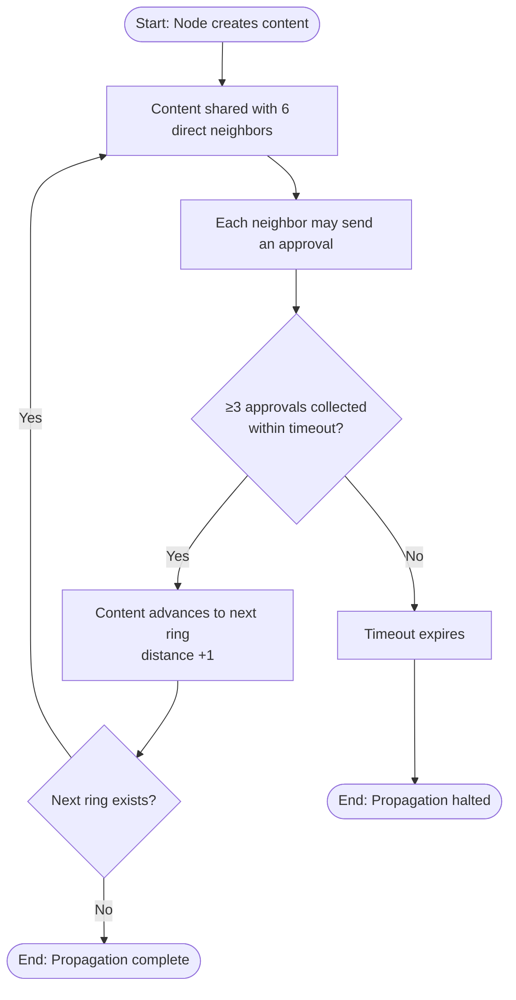
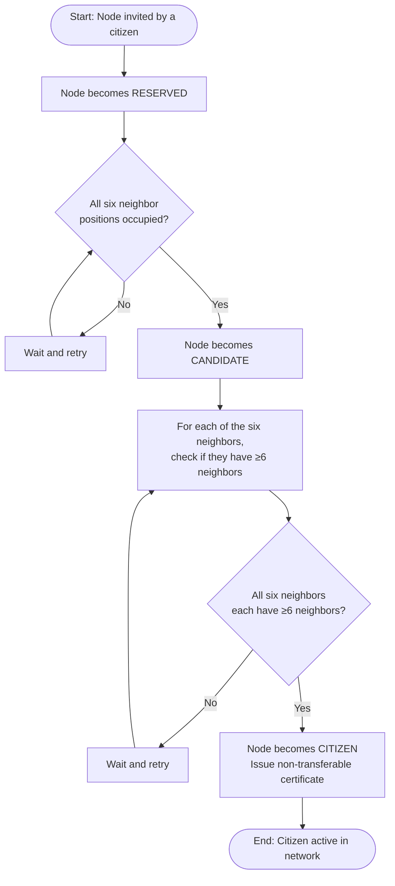
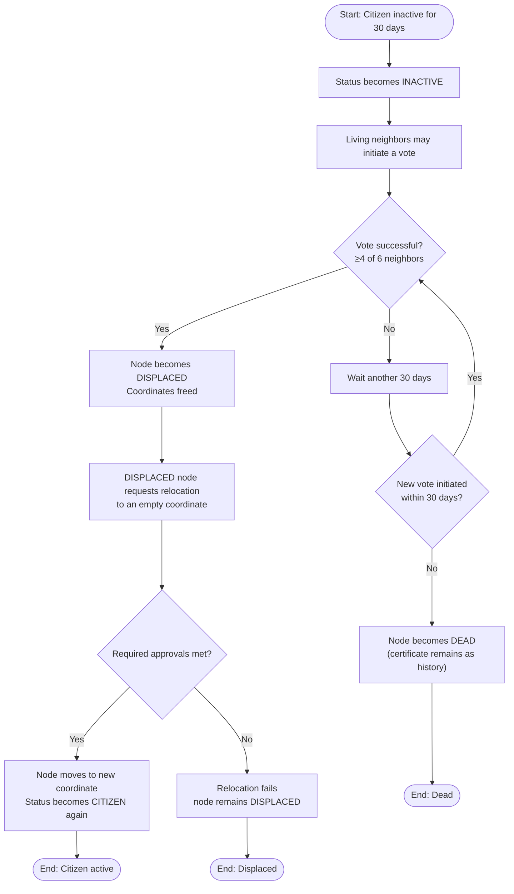

<div align="center">


# 🐝 KANDO

## Decentralized | Censorship-Resistant | Gas-Free Social Network Protocol

[](LICENSE)
[](https://nextjs.org/)
[](https://react.dev/)
[](https://www.typescriptlang.org/)
[](https://tailwindcss.com/)
[](https://go.dev/)
[](CONTRIBUTING.md)
[](https://github.com/comfyuse/Kando/stargazers)
[](https://github.com/comfyuse/Kando/network/members)

[Website](https://kandonet.com) · [Whitepaper](KANDO_The_Digital_Hive.pdf) · [Report Bug](https://github.com/comfyuse/Kando/issues) · [Request Feature](https://github.com/comfyuse/Kando/issues)

</div>

---

## 📖 About

**KANDO** is a decentralized, censorship-resistant, and gas‑free social network protocol built on **complex contagion theory** — the scientific insight that trust, cooperation, and collective action spread through reinforcement from multiple independent sources (Damon Centola, University of Pennsylvania).

No blockchain, no gas fees, no central servers — just a self‑organising hexagonal mesh network with a **3-Approval propagation rule** that stops spam and misinformation at the first ring.

> Research-driven. Practical. Uncensorable.

The hexagonal topology, the rule of three confirmations, and the co‑eclosion citizenship protocol have been filed as a utility model with the **Estonian Patent Office**. All protocol code, the simulator, and documentation are released under the **AGPLv3** license.

---

## ✨ Key Features

| Feature | Description |
|---------|-------------|
| 🔒 **Censorship-Resistant** | Dual‑layer architecture (overlay + physical mesh) works over the internet and offline (Bluetooth LE, Wi‑Fi Direct, LoRa). No central point of control. |
| ⛽️ **Gas‑Free** | DHT‑based storage — no blockchain, no tokens, no gas fees. Ordinary users pay zero transaction costs. |
| 🌐 **Decentralised** | Self‑healing network with local voting, relocation, and no single point of failure. |
| 🧠 **3-Approval Rule** | Content advances to the next ring only after at least 3 of 6 neighbors approve. Reduces bandwidth by 60‑80% and acts as a native spam filter. |
| 🕊️ **Optical Channels** | Direct links between non‑neighbor users for urgent/public information (earthquakes, security alerts). Bypass the 3‑approval rule, limited in number, and require both parties to confirm. |
| 🛡️ **Sybil-Resistant** | Co‑eclosion citizenship makes fake identities exponentially expensive — no Proof-of-Work or Proof-of-Stake required. |
| 🎮 **Network Simulator** | Interactive hexagonal grid simulation to visualize complex contagion propagation in real time. |
| 🆔 **Portable Identity** | Non‑transferable cNFT / DID passport (self‑sovereign identity) — use across all KANDO‑compatible apps without revealing real identity. |
| 🔷 **Hexagonal Topology** | Maximizes clustering coefficient (0.4‑0.67) — optimal for complex contagion. O(1) routing complexity via axial coordinates. |
| 🎯 **Optional Rewards** | Non‑mandatory gamification layer — earn reputation points for inviting, endorsing, voting, and participating. No real money involved. |
| 🧩 **Open Source** | AGPLv3 licensed — transparent, auditable, and community‑driven. Patent‑protected (Estonian Patent Office) against commercial copycats. |

---

## 🧠 How It Works

### Hexagonal Grid & Axial Coordinates

Each node is assigned axial coordinates `(q, r)`. The third implicit coordinate is `s = -q - r`. The hexagonal distance between two nodes is:

```
distance = (|Δq| + |Δr| + |Δs|) / 2
```

**Ring structure:**
- **Ring 0**: Queen node at `(0, 0)`
- **Ring 1**: 6 nodes at distance 1
- **Ring 2**: 12 nodes at distance 2
- **Ring N**: 6N nodes at distance N

Each node maintains **at most 6 direct neighbors**.

**Why six?** A hexagonal grid maximizes the clustering coefficient (0.4‑0.67) compared to square or random graphs, which is optimal for complex contagion.

### 3-Approval Propagation (Complex Contagion)

1. Content is initially shared only with a node's 6 direct neighbors
2. Each neighbor may send a cryptographic approval
3. If **at least 3 independent approvals** are collected within a predetermined timeout (e.g., 24 hours), the content advances to the next ring (distance +1)
4. The process repeats at each ring
5. If the threshold is not met, propagation stops permanently

**Benefits:**
- **Bandwidth reduction** — low-quality content stops at the first ring, reducing network traffic by an estimated 60‑80% compared to flooding or gossip protocols
- **Built-in spam filter** — fake news and rumors cannot collect three approvals from trusted neighbors and therefore never leave the local neighborhood

### Optical Channels (Simple Contagions)

For urgent information (earthquakes, security alerts) and to help the network spread, KANDO provides **optical channels** — direct links between two non-neighbor users that bypass the 3-approval rule. Their number is limited (e.g., 10 per user), they are only allowed for public and urgent content, and **both parties must confirm the channel**.

### Three-Stage Citizenship Protocol (Co‑eclosion)

A node passes through three statuses:

| Status | Condition | Permissions |
|--------|-----------|-------------|
| **RESERVED** | Created by invitation from an existing citizen, without any neighbor requirement | Occupies a coordinate but is not yet active |
| **CANDIDATE** | Promoted from RESERVED when all six of its immediate neighbor positions are occupied (by any node type) | Visible but cannot vote or create content |
| **CITIZEN** | Promoted from CANDIDATE when each of those six neighbors itself has at least six neighbors — i.e., the second ring around the node is completely filled | Full active membership — can invite, approve, send content, and vote |

Upon becoming a CITIZEN, the node receives a non-transferable digital certificate (cNFT) — a self-sovereign identity passport (DID). This certificate is bound to the node's public key forever and can be used across all KANDO-compatible applications without revealing real identity.

**Why does this resist Sybil attacks?** To create a single fake citizen, an attacker would need to fill six neighbor positions (each of which must itself have six neighbors). This exponential requirement makes large-scale Sybil attacks prohibitively expensive — without any Proof-of-Work or Proof-of-Stake.

### Inactivity and Relocation

**Inactivity handling:**
- A citizen that shows no activity for 30 days transitions to **INACTIVE** status
- Living neighbors may initiate a vote — for six neighbors, four positive votes are required
- If the vote succeeds, the node becomes **DISPLACED** and its coordinates are freed
- If no vote succeeds for an additional 30 days, the node becomes **DEAD** — its certificate remains as a historical record but no longer grants active membership

**Relocation:**
A DISPLACED node may request relocation to an empty coordinate. The number of approvals required from the destination's neighbors depends on the request type (voluntary move of an active citizen, a DISPLACED node moving to a different coordinate, or a DISPLACED node returning to its own previous coordinate if still empty). If approvals are met, the node moves and its status becomes CITIZEN again. Otherwise, relocation fails and the node remains DISPLACED.

### Dual-Layer Architecture

KANDO does not rely on permanent internet connectivity:

- **Layer One (Overlay Network)** — based on virtual coordinates `(q, r)`. Neighbors are chosen by trust and shared interests, not by geographic location. Two people on different continents can be virtual neighbors.
- **Layer Two (Physical Mesh Network)** — uses Bluetooth LE, Wi-Fi Direct, or LoRa for offline local communication when the internet is cut off.

Thus KANDO supports both global, trust-based relationships and local, offline communication — without any central server. Online relays are used only for network stability.

### Storage: DHT, Not Blockchain

All node records (coordinates, status, neighbor references, voting records, certificates) are stored in a **Distributed Hash Table (DHT)** — a Kademlia DHT. No blockchain, no token, no gas fee is required. Ordinary users pay zero transaction costs.

### Optional Reward Layer (Gamification)

KANDO includes an **optional, non-mandatory** reward mechanism to encourage growth. Users can earn points by inviting friends, endorsing content, voting, performing charitable actions, and participating in games. These points raise social reputation and appear as badges on a profile. **No real money is involved**, and the network is fully usable without the reward system. This layer is separate from the core protocol and does not affect its fundamental operation.

---

## 🧪 Technical Effects & Benefits

| Feature | Technical Effect |
|---------|------------------|
| Hexagonal topology + Manhattan distance | O(1) routing complexity |
| 3-Approval rule | 60‑80% bandwidth reduction, native spam filter |
| Co‑eclosion protocol | Exponential Sybil resistance without PoW/PoS |
| Local voting & relocation | Self-healing, resilience to long-term internet outages |
| DHT storage | No blockchain, no gas fees — zero cost for ordinary users |
| Dual-layer architecture | Works offline via mesh networks, online via relays |

---

## 📊 Comparison with Existing Solutions

| Feature | **KANDO** | BitChat / Briar | Nostr | Blockchain Social |
|---------|:---------:|:---------------:|:-----:|:-----------------:|
| Offline mesh | ✅ (BLE, Wi-Fi Direct, LoRa) | ✅ | ❌ | ❌ |
| Gas fees | ✅ zero | ✅ zero | ✅ zero | ❌ high |
| Spam / misinformation filter | ✅ (3-approval rule) | ❌ | ❌ | ❌ |
| Sybil resistance | ✅ (co‑eclosion) | ❌ | ❌ (optional PoW) | ✅ (expensive) |
| Identity portability | ✅ (cNFT / DID) | ❌ | ✅ (public key) | ✅ (NFT) |
| Scalable routing | ✅ O(1) | ❌ O(N) | ❌ (relay-based) | 🟡 (sharding needed) |

---

## 🎯 Use Cases

- **Journalists & civil-society activists** — anonymous communication during internet outages; content verified by multiple peers; organizing social movements through complex contagion.
- **Relief organizations** — coordinating rescue operations in disaster areas where communication infrastructure is destroyed.
- **Decentralized app developers** — building on a trust layer that provides local identity and consensus.

---

## 🚀 Getting Started

### Prerequisites

- [Node.js](https://nodejs.org/) 18+ and npm
- [Go](https://go.dev/) 1.21+ (only required for the P2P/DHT backend)

### Frontend (simulator + landing + chat UI)

```bash
# Clone the repository
git clone https://github.com/comfyuse/Kando.git
cd Kando

# Install dependencies
npm install

# Run the development server
npm run dev

# Open http://localhost:3000
```

### Backend (Go libp2p / Kademlia DHT + P2P chat)

The Go backend implements the Kademlia DHT, peer routing, and a WebSocket relay for the P2P chat.

```bash
# Run the backend on :8080
npm run backend
# (equivalent to: cd backend-go && go run cmd/server/main.go)
```

### Run both together

```bash
npm run dev:all   # frontend on :3000 + backend on :8080
```

---

## 🧱 Tech Stack

| Layer | Technologies |
|-------|--------------|
| **Frontend** | Next.js 16, React 19, TypeScript, Tailwind CSS 3.4, Framer Motion |
| **Visualization** | HTML Canvas (2D hexagonal simulator), Three.js / React Three Fiber |
| **Backend** | Go 1.21, Kademlia DHT, Gorilla WebSocket, libp2p-style P2P networking |
| **Crypto** | ECDH (P-256) key exchange + AES-GCM end-to-end encryption (Web Crypto API) |

---

## 📁 Project Structure

```
Kando/
├── app/                    # Next.js app router
│   ├── chat/               # P2P chat page + components
│   ├── simulator/          # Network simulator page
│   ├── docs/               # Documentation pages
│   └── open-source/        # Open-source info page
├── components/             # Shared React components (Scene2D, panels…)
├── lib/                    # Core logic
│   ├── simulator.ts        # Hexagonal network model (cells, rings, voting)
│   ├── dht-client.ts       # DHT client + E2E encryption
│   └── p2p-client.ts       # WebSocket P2P client
├── backend-go/             # Go backend
│   ├── cmd/server/         # HTTP/WebSocket server entrypoint
│   └── pkg/
│       ├── kademlia/       # Kademlia DHT (id, buckets, routing, store, rpc)
│       ├── p2p/            # P2P network layer
│       └── dht/            # DHT data structures
└── public/                 # Static assets
```

---

## 🎮 Network Simulator

The interactive simulator lets you visualize KANDO's complex contagion propagation:

- **Hexagonal Grid** — each cell represents a node with axial coordinates
- **Growth Mode** — watch the network self-organise as cells progress from temporary → candidate → citizen
- **Message Mode** — watch content spread ring by ring based on the 3-approval rule, with live approval/rejection votes
- **Live Metrics** — churn rate, net growth, viral coefficient, births/deaths

---

## 📊 Protocol Flowcharts

### 1 — 3-Approval Propagation Rule



### 2 — Co‑eclosion Citizenship Protocol (RESERVED → CANDIDATE → CITIZEN)



### 3 — Local Voting & Relocation



---

## 🗺️ Roadmap

| Phase | Timeline | Milestones |
|-------|----------|------------|
| **Phase 0 — Foundation** ✅ | Completed (before 20 May 2026) | React simulator (proof of concept), Whitepaper v1.0, utility model filed with Estonian Patent Office |
| **Phase 1 — MVP** | 20 May 2026 – 20 Jan 2027 | Go-libp2p core (Host, Kademlia DHT, GossipSub), 3-approval rule, co‑eclosion citizenship, local voting & relocation → **MVP Alpha (20 Jan 2027)** |
| **Phase 2 — Public Testnet** | Feb – Sep 2027 | Testnet with 100+ volunteer nodes, user-friendly CLI client, stress testing & performance tuning → **Testnet stable (30 Sep 2027)** |
| **Phase 3 — Mainnet** | Oct – Dec 2027 | Production release (AGPLv3), mobile apps (iOS/Android), LoRa long-range mesh integration → **Mainnet live (31 Dec 2027)** |

---

## 🤝 Contributing

Contributions are welcome! KANDO is looking for:

- **Open-source contributors** — Go, cryptography, P2P networks
- **Early testers & partners** — aid organizations, journalism networks
- **Grant support** — e.g. NLnet, NGI, to accelerate the Go libp2p implementation

1. Fork the repository
2. Create a feature branch (`git checkout -b feature/amazing-feature`)
3. Commit your changes (`git commit -m 'Add amazing feature'`)
4. Push to the branch (`git push origin feature/amazing-feature`)
5. Open a Pull Request

Please read [CONTRIBUTING.md](CONTRIBUTING.md) for details (if present), or open an issue to discuss larger changes first.

---

## 📜 License

This project is licensed under the **GNU Affero General Public License v3.0 (AGPLv3)** — see the [LICENSE](LICENSE) file for details.

The hexagonal topology, the rule of three confirmations, and the co‑eclosion protocol have been filed as a utility model with the Estonian Patent Office. The patent protects against closed-source commercial copycats; the protocol itself remains free and open under AGPLv3.

---

## 🔗 Links

- 🌐 Website: [kandonet.com](https://kandonet.com)
- 📂 Repository: [github.com/comfyuse/kando](https://github.com/comfyuse/kando)
- 📄 Whitepaper: [KANDO — The Digital Hive](KANDO_The_Digital_Hive.pdf)

---

<div align="center">

**KANDO** — *A practical, scientific, and fully open-source solution for a free and uncensored internet.*

Built with 🐝 by the KANDO community.

</div>
