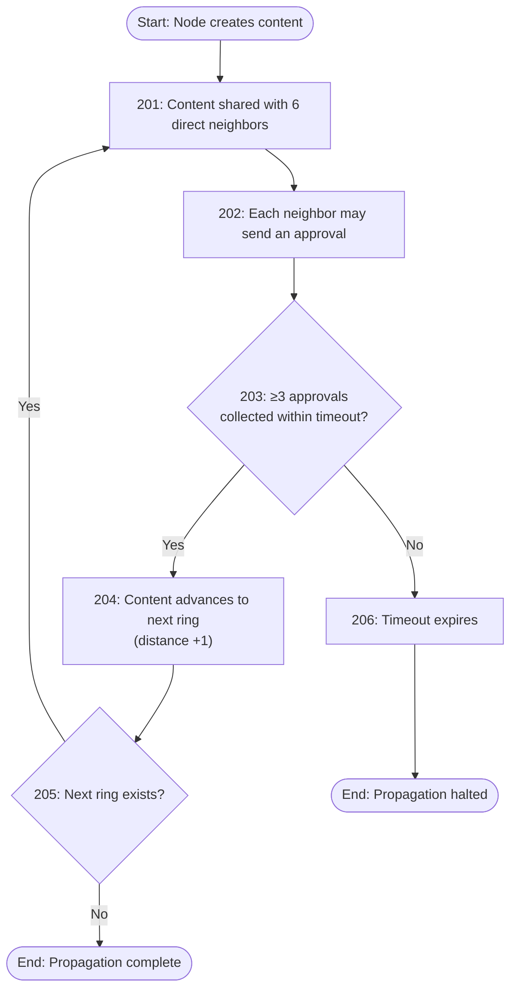

<div align="center">


# 🐝 KANDO

## Decentralized | Censorship-Resistant | Gas-Free Social Network Protocol

[](LICENSE)
[](https://nextjs.org/)
[](https://www.typescriptlang.org/)
[](https://tailwindcss.com/)
[](CONTRIBUTING.md)
[](https://github.com/comfyuse/Kando/stargazers)
[](https://github.com/comfyuse/Kando/network/members)

</div>

---

## 📖 About

**KANDO** is a decentralized, censorship-resistant, and gas‑free social network protocol. 

No blockchain, no gas fees, no central servers – just a self‑organising hexagonal mesh network based on the **3-Approval Rule**.

> Built on the research of complex contagion (Damon Centola, UPenn), KANDO turns scientific theory into a practical, open, and uncensorable communication layer.

---

## ✨ Key Features

| Feature | Description |
|---------|-------------|
| 🔒 **Censorship-Resistant** | Works over internet and offline mesh (Bluetooth, Wi‑Fi Direct, LoRa). No central point of control. |
| ⛽️ **Gas‑Free** | Zero transaction costs – no blockchain, no tokens, no hidden fees. |
| 🌐 **Decentralised** | DHT‑based, self‑healing network with local voting and relocation. |
| 🧠 **3-Approval Rule** | Messages spread only after 3 out of 6 neighbors approve – stopping fake news and spam at the first ring. |
| 🎮 **Network Simulator** | Interactive hexagonal grid simulation to visualize the protocol in action. |
| 🆔 **Portable Identity** | Non‑transferable cNFT / DID passport – use across all KANDO‑compatible apps. |
| 🧩 **Open Source** | AGPLv3 licensed – transparent, auditable, and community‑driven. |

---

## 📊 1-Approval Propagation Rule


## 📊 2-Co‑eclosion Citizenship Protocol (RESERVED → CANDIDATE → CITIZEN)

```mermaid
flowchart TD
    Start([Start: Node invited by a citizen]) --> Step301[301: Node becomes RESERVED]
    Step301 --> Decision302{302: All six neighbor\npositions occupied?}
    Decision302 -->|No| Wait[Wait & retry]
    Wait --> Decision302
    Decision302 -->|Yes| Step303[303: Node becomes CANDIDATE]
    Step303 --> Step304[304: For each of the six neighbors,\ncheck if they have ≥6 neighbors each]
    Step304 --> Decision305{305: All six neighbors\neach have ≥6 neighbors?}
    Decision305 -->|No| Wait2[Wait & retry]
    Wait2 --> Step304
    Decision305 -->|Yes| Step306[306: Node becomes CITIZEN\nIssue non‑transferable certificate]
    Step306 --> End([End: Citizen active in network])
  ```
  ## 📊 3-Local Voting & Relocation
  ```mermaid
   flowchart TD
    Start([Start: Citizen inactive for 30 days]) --> Step401[401: Status becomes INACTIVE]
    Step401 --> Step402[402: Living neighbors may initiate a vote]
    Step402 --> Decision403[s20]
    
    Decision403 -->|No| Step404[404: Wait another 30 days]
    Step404 --> Decision405[s21]
    Decision405 -->|No| Step406["406: Node becomes DEAD\n(certificate remains as history)"]
    Decision405 -->|Yes| Decision403
    
    Decision403 -->|Yes| Step407[407: Node becomes DISPLACED\nCoordinates freed]
    Step407 --> Step408[408: DISPLACED node requests relocation\nto an empty coordinate]
    Step408 --> SelectType[Select move type]
    
    SelectType --> TypeA[Type A: Voluntary move\nof an active citizen]
    SelectType --> TypeB[Type B: DISPLACED to\ndifferent empty coordinate]
    SelectType --> TypeC["Type C: Return to previous\ncoordinate (if empty)"]
    
    TypeA --> Req4[Need 4 approvals]
    TypeB --> Req3[Need 3 approvals]
    TypeC --> Req2[Need 2 approvals]
    
    Req4 --> Decision410[s24]
    Req3 --> Decision410
    Req2 --> Decision410
    
    Decision410 -->|Yes| Step411[411: Node moves to new coordinate\nStatus becomes CITIZEN again]
    Decision410 -->|No| Step412[412: Relocation fails\nnode remains DISPLACED]
    
    Step411 --> End([End: Citizen active])
    Step406 --> End2([End: Dead])
    Step412 --> End3([End: Displaced])
 ```
